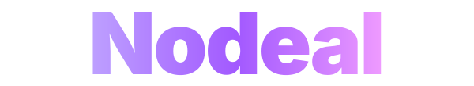
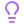
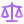

  
  <h3>The next-generation framework for Roblox experiences.</h3>
  
  

    &nbsp;&nbsp;&nbsp;&nbsp;
     
    &nbsp;&nbsp;
  

   

  

    <b>Nodeal</b> provides a clean, highly modular architecture designed to streamline game development in <b>Roblox Studio</b>,   allowing you to build scalable and easily maintainable systems.
  

   

  

##  Why Nodeal?

Nodeal isn't just a standard library; it's a foundational ecosystem for Roblox Studio. Instead of forcing specific networking or state management solutions, Nodeal provides the **core tools** (like native decorators and dynamic resolution) to make any architecture possible. It empowers developers to build their own robust systems and allows the community to easily share powerful packages.

- **Native Luau Decorators:** Supercharge your functions effortlessly by injecting behaviors through simple comment blocks.
- **Intelligent Resolution:** Never hardcode a file path again. Move your modules anywhere, and the framework resolves them dynamically.
- **Passive Security:** Nodeal naturally slows down reverse engineering and shields your game logic from exploiters with secure, deterministic in-memory loading.
- **Package Ecosystem:** Designed to support a rich, community-driven ecosystem where extensions and services can be shared instantly.

##  Contributing

Nodeal is an open ecosystem driven by its community. There are many ways you can help:

- **Core Framework:** Help us improve the Nodeal plugin and runtime. Read our [Contribution Guidelines](CONTRIBUTING.md) to get started.
- **Package Ecosystem:** Create and share your own Nodeal packages with the community!
- **Feedback & Ideas:** Join our [Discord Server](https://discord.gg/hTqXPRduHp) to suggest features, report bugs, or just chat with other developers.

##  Supporters

Nodeal is **free and forever**. The continuous development of this framework is made possible by the passion of our contributors and the generous support of our community. A massive thank you to everyone who helps make Nodeal possible!

  <h3> Recent Donators</h3>
  

    

  <h3> Monthly Subscribers</h3>
  

---

###  License

Distributed under the **Nodeal Public License (NPL)**. See [`LICENSE`](LICENSE) for more information.

> **TL;DR:** You generally cannot sell the framework source code itself, but you **CAN** use it to build commercial games, plugins, and modules.

---

  

    Built with  by <a href="https://github.com/furymob-git"><b>FURYMOB</b></a> and the <b>Nodeal Community</b>
  

